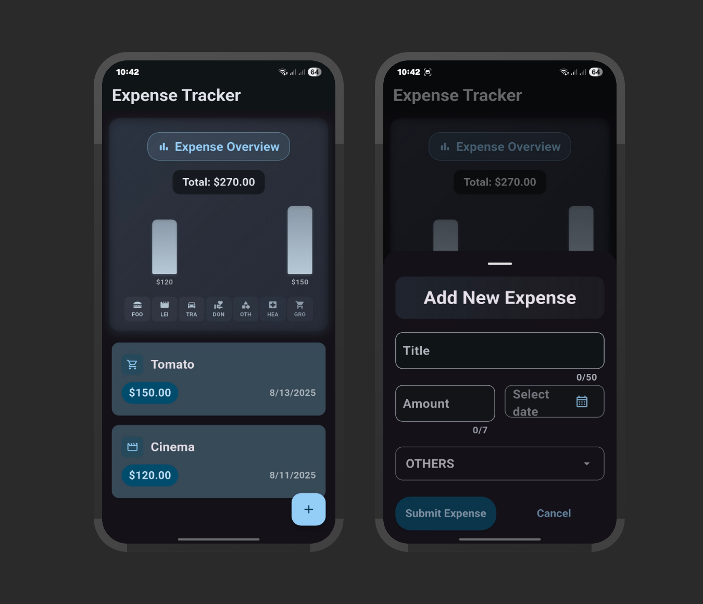

# Expense Tracker 💰

A sleek Flutter demo application for tracking personal expenses with beautiful data visualization and intuitive expense management features.

## About the App

The Expense Tracker app helps users monitor their spending habits with an elegant dark-themed interface. Track expenses across different categories, visualize spending patterns with interactive charts, and maintain better financial awareness.

### Key Features

📊 **Visual Analytics** - Interactive bar charts showing expense distribution across categories with total spending overview

💳 **Expense Management** - Easy-to-use expense entry form with title, amount, date selection, and category classification

🎯 **Category Organization** - Organized expense tracking across multiple categories:
- Food & Dining
- Leisure & Entertainment  
- Travel & Transportation
- Work & Business
- Health & Medical
- Others

📱 **Modern UI** - Clean dark-themed interface with Material 3 design principles and smooth user experience

📅 **Date Tracking** - Calendar integration for accurate expense date recording

💡 **Quick Actions** - Floating action button for rapid expense entry and streamlined workflow

## Design Highlights

- **Dark Theme Interface**: Professional dark UI with teal accent colors for better visual comfort
- **Data Visualization**: Clear bar charts displaying spending patterns and category breakdowns
- **Intuitive Forms**: User-friendly expense entry with input validation and category selection
- **Real-time Updates**: Immediate chart updates when new expenses are added
- **Clean Typography**: Well-structured text hierarchy for excellent readability

## Tech Stack

- **Flutter** - Cross-platform mobile development framework
- **Dart** - Programming language
- **Material 3** - Modern Material Design components
- **Charts** - Data visualization for expense analytics
- **SQLite** - Local database for expense storage

Perfect for anyone looking to gain better control over their personal finances with a beautiful, easy-to-use mobile application!

*This is a demo application showcasing Flutter development skills and modern mobile app design.*
