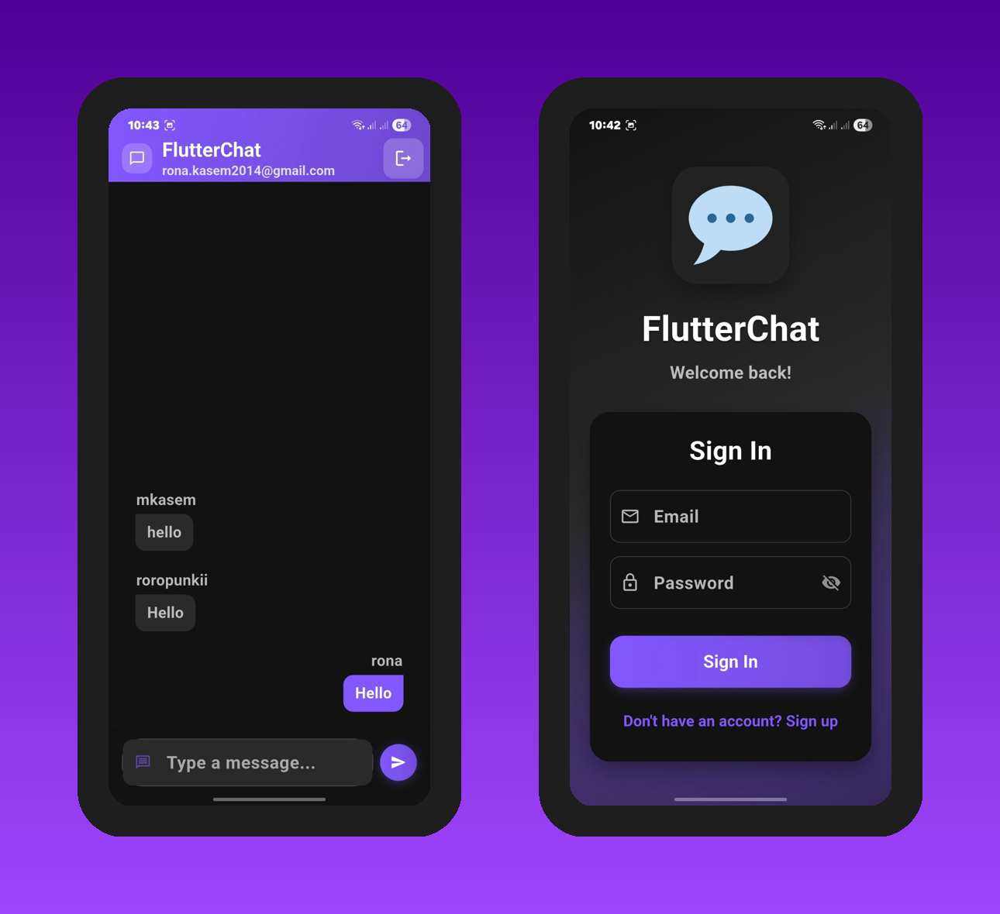

# Flutter Chat 💬

A modern Flutter demo application for real-time messaging with Firebase integration, featuring user authentication and instant messaging capabilities.

## About the App

Flutter Chat is a comprehensive messaging application that demonstrates real-time communication features with a clean, user-friendly interface. Built with Firebase for backend services, it provides secure authentication and instant message delivery.

### Key Features

🔐 **User Authentication** - Secure sign-up and login system with Firebase Authentication

💬 **Real-time Messaging** - Instant message delivery and synchronization across devices

👤 **User Profiles** - Profile management with user avatars and display names

🔔 **Push Notifications** - Firebase Cloud Messaging for message notifications

📱 **Modern UI** - Clean Material 3 design with dark theme support

🚀 **Real-time Updates** - Live message updates without page refresh

🔒 **Secure Communication** - Firebase security rules for protected user data

## Design Highlights

- **Intuitive Interface**: Clean chat interface optimized for mobile messaging
- **Material 3 Design**: Modern Flutter design components and theming
- **Responsive Layout**: Adaptive UI that works across different screen sizes
- **Dark Theme Support**: Eye-friendly dark mode for better user experience
- **Smooth Animations**: Fluid transitions and micro-interactions

## Tech Stack

- **Flutter** - Cross-platform mobile development framework
- **Firebase Auth** - User authentication and management
- **Cloud Firestore** - Real-time NoSQL database for messages
- **Firebase Messaging** - Push notifications for new messages
- **Material 3** - Modern Material Design components
- **Dart** - Programming language

Perfect for demonstrating real-time app development skills and Firebase integration in a modern mobile messaging context!

*This is a demo application showcasing Flutter development skills with Firebase backend integration.*
