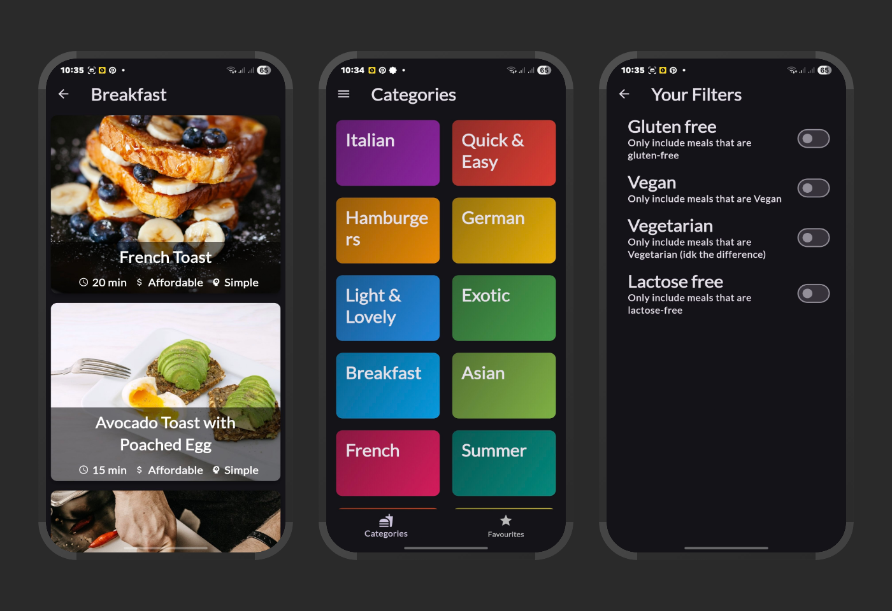

# Meals App 🍽️

A beautiful Flutter demo application for discovering and organizing delicious recipes. Browse through various meal categories, save your favorites, and apply dietary filters to find the perfect meal for any occasion.

## About the App

The Meals app is designed to make meal discovery enjoyable and personalized. Whether you're looking for a quick breakfast, exploring exotic cuisines, or need to accommodate specific dietary requirements, this app has you covered.

### Key Features

🎯 **Category Browsing** - Explore meals organized by cuisine types including Italian, German, Asian, French, and more

⭐ **Favorites System** - Save your favorite recipes for quick access with a dedicated favorites tab

🔍 **Smart Filtering** - Apply multiple dietary filters simultaneously:
- Gluten-free options
- Vegan recipes
- Vegetarian meals
- Lactose-free alternatives

📱 **Beautiful UI** - Dark themed interface with adaptive Material 3 design that looks great on any device

⚡ **Quick Access** - Bottom navigation for seamless switching between categories and favorites

🍳 **Detailed Recipes** - Each meal includes cooking time, difficulty level, and affordability indicators

## Design Highlights

- **Modern Dark Theme**: Sleek dark interface with vibrant category cards
- **Intuitive Navigation**: Clean bottom navigation with clear categories and favorites sections
- **Visual Appeal**: High-quality food photography and colorful category organization
- **User-Friendly Filters**: Easy-to-use toggle switches for dietary preferences
- **Responsive Layout**: Optimized for various screen sizes and orientations

## Tech Stack

- **Flutter** - Cross-platform mobile development framework
- **Dart** - Programming language
- **Material 3** - Modern Material Design theming system
- **Custom Widgets** - Reusable components for consistent UI/UX

Perfect for food enthusiasts, home cooks, and anyone looking to discover new recipes while maintaining their dietary preferences!

*This is a demo application showcasing Flutter development skills and modern mobile app design.*
